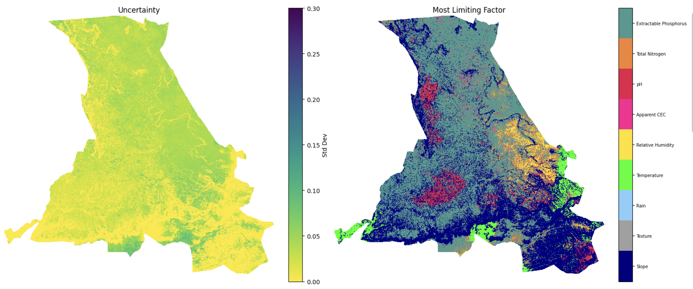
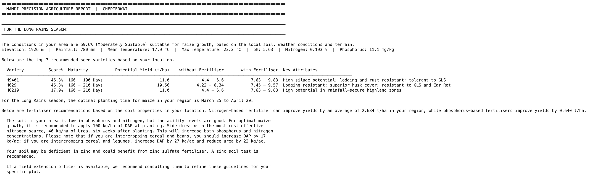

  

### Overview

This repository contains the backend code and data for a SMS and website-based maize seed and fertiliser framework for Nandi County, Kenya, which integrates soil, weather, and climate-extreme data to (i) calculate land suitability scores at 30m resolution along with their associated uncertainties and (ii) provide seed variety, fertiliser, and fertiliser rate recommendations by combining the soil and metereological characteristics of each 30 x 30m area with information from seed and fertiliser trials previously conducted in the Rift Valley Upper region. Output recommendations are currently under field validation. 

  

  <em>Figure 1: Example ward-level output of the model; uncertainty is passed separately to the frontend.</em>

### Architecture Summary

The system is based on the existing CropSuite framework (Zabel et al., 2025), extending it via:

(i) Adaptation of the global agronomic thresholds of Sys et al. (1993) - derived from broad international data - to Kenyan conditions using soil nutrient critical levels from KALRO (NAAIAP, 2014).

(ii) Conditioning of crop failure probability on ENSO phase via a Bayesian Beta-Binomial model, drawing on 44 years of historical records (1981–2024). In East Africa, ENSO is among the strongest drivers of inter-seasonal rainfall variability (Nicholson and Kim, 1997), meaning that the long-run failure risk at any given location differs substantially between El Niño, La Niña, and Neutral years; phase-conditioning produces failure probability estimates that better reflect this structure and therefore more reliably inform planting and input decisions.

(iii) Propagation of per-pixel iSDA soil prediction uncertainty through the Liebig minimum via Monte Carlo simulation, producing spatially explicit confidence estimates alongside each suitability classification. Where soil prediction uncertainty is high, a suitability score carries less practical weight; providing uncertainty estimates alongside the classification allows extension officers and farmers to identify locations where recommendations should be treated with greater caution and where targeted soil sampling would most improve guidance quality.

(iv) Translation of probabilistic suitability outputs into ward-level agronomic recommendations covering seed variety selection, expected yield estimation with and without fertiliser, and fertiliser prescription calibrated to Kenyan agronomic data. These are then disseminated in a clear manner via the Web-GIS and USSD/SMS platform described in Sections 4.2 and 4.3.

More detail on the methodology can be found here. 

### References

NAAIAP. (2017). Soil Suitability Evaluation for Maize Production in Kenya. Technical Report. Kenya Agricultural & Livestock Research Organization.

Nicholson, S. E., & Kim, J. (1997). The relationship of the El Niño Southern Oscillation to African rainfall. International Journal of Climatology, 17(2), 117–135.

Sys, C., Van Ranst, E., Debaveye, J., & Beernaert, F. (1993). Land Evaluation. Part III: Crop Requirements. General Administration for Development Cooperation, Brussels.

Zabel, F., Knüttel, M., & Poschlod, B. (2025). CropSuite v1.0 – a comprehensive open-source crop suitability model. Geoscientific Model Development, 18(4), 1067–1087.

